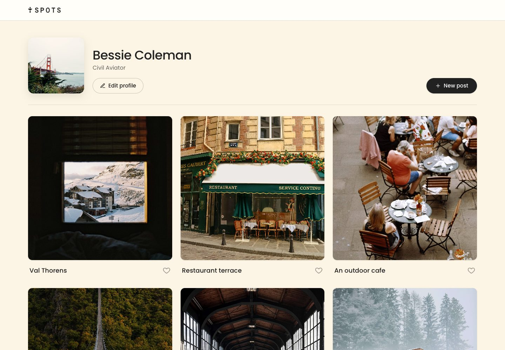
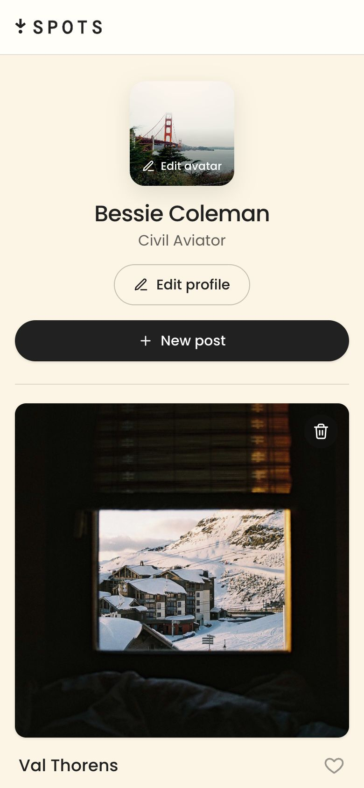
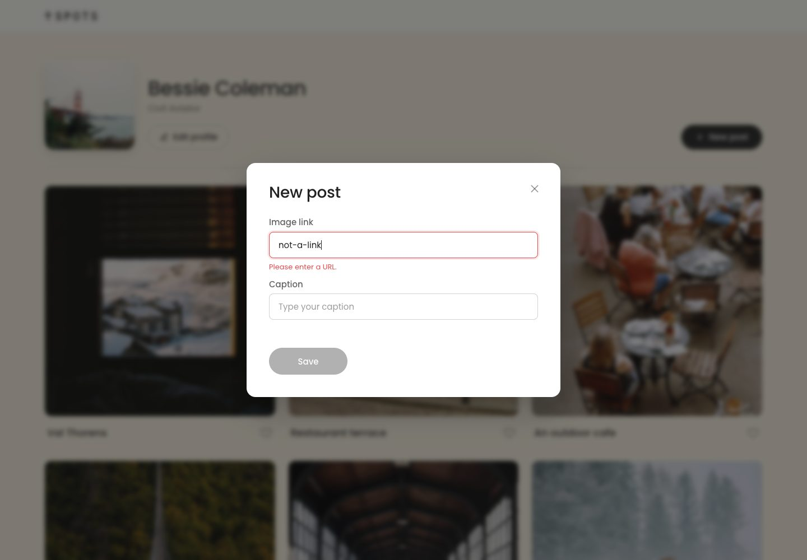

# Spots

[](https://github.com/xfactor107/se_project_spots/actions/workflows/ci.yml)

A responsive photo-sharing profile page where users can post the places they love, like and delete posts, and edit their profile, all synced to a REST API.

**[Live demo →](https://xfactor107.github.io/se_project_spots/)**

Built as part of the TripleTen Software Engineering program.



<p align="center">
  
  &nbsp;&nbsp;
  
</p>

## Features

- **Profile management**: edit name, description, and avatar
- **Posts**: add a photo by URL, open it in a full-size preview, like/unlike, and delete (with confirmation)
- **Live data**: all changes persist through a REST API, with optimistic like updates
- **Form validation**: real-time, accessible validation with inline error messages
- **Polished UX**: loading skeletons, "Saving…" button states, error toasts, and an empty state
- **Accessible**: labelled dialogs, focus trapping and restoration, keyboard support (Esc to close), and visible focus rings
- **Responsive**: fluid grid from mobile (320px) up to wide desktop screens
- **Respects `prefers-reduced-motion`**

## Tech stack

| Area    | Tools                                                      |
| ------- | ---------------------------------------------------------- |
| Markup  | Semantic HTML5, `<template>` elements                      |
| Styling | CSS with BEM methodology, custom properties, Grid, Flexbox |
| Logic   | Vanilla JavaScript (ES6 classes & modules), Fetch API      |
| Icons   | Inline SVG (`currentColor`, themeable from CSS)            |
| Tooling | Webpack 5, Babel, PostCSS, ESLint, Prettier                |
| CI/CD   | GitHub Actions → GitHub Pages                              |

## Getting started

```bash
git clone https://github.com/xfactor107/se_project_spots.git
cd se_project_spots
npm install
npm run dev      # start dev server at http://localhost:8080
```

| Script                 | Description                                 |
| ---------------------- | ------------------------------------------- |
| `npm run dev`          | Start the webpack dev server with reloading |
| `npm run build`        | Create a production build in `dist/`        |
| `npm run lint`         | Lint JavaScript with ESLint                 |
| `npm run format`       | Format all files with Prettier              |
| `npm run format:check` | Check formatting without writing            |
| `npm run deploy`       | Build and publish `dist/` manually          |

Every push and pull request runs lint, format check, and build in GitHub Actions. Pushes to `main` deploy to GitHub Pages automatically.

## Architecture

The UI is split into small, single-purpose classes that `pages/index.js` wires together:

| Class                   | Responsibility                                              |
| ----------------------- | ----------------------------------------------------------- |
| `Api`                   | Wraps every REST call and normalizes error handling         |
| `Card`                  | Builds one post from the `<template>`, exposes like/remove  |
| `Section`               | Renders a list of items, loading skeletons, and empty state |
| `Popup`                 | Base modal: open/close, Esc & overlay close, focus trap     |
| `PopupWithForm`         | Collects form values, shows "Saving…", closes on success    |
| `PopupWithImage`        | Full-size image preview                                     |
| `PopupWithConfirmation` | Confirms a destructive action before running it             |
| `FormValidator`         | Live validation with accessible error messages              |
| `UserInfo`              | Reads and updates the profile on the page                   |
| `Toast`                 | Short status messages for errors                            |

```
src/
├── blocks/        # One CSS file per BEM block (card, modal, profile…)
├── components/    # UI classes listed above
├── pages/         # Entry point: index.js + index.css
├── utils/         # Api class, constants, helpers
├── vendor/        # normalize.css and font-face declarations
├── images/
└── index.html
```

## Design notes & limitations

- **Shared demo account.** The API is a course-provided sandbox authenticated by a single token. There is no login, so every visitor sees and edits the same profile and posts. The token is visible in the client bundle by design. In a production app it would be replaced by per-user authentication (e.g. sessions or JWTs issued by a backend) and never shipped to the browser.
- **Self-healing demo data.** Because anyone can delete every post, the app re-seeds a set of starter posts when the feed is empty, so the live demo never loads blank.
- **Optimistic likes.** Likes update instantly and roll back if the request fails.

## What I learned

- Structuring a vanilla JS app with object-oriented components and promise chains
- Writing reusable, configurable form validation
- Designing a small token-based design system with CSS custom properties
- Making interactive UI (modals, icon buttons) accessible to keyboard and screen-reader users

## Author

**Alejandro Jimenez**, [GitHub](https://github.com/xfactor107)
